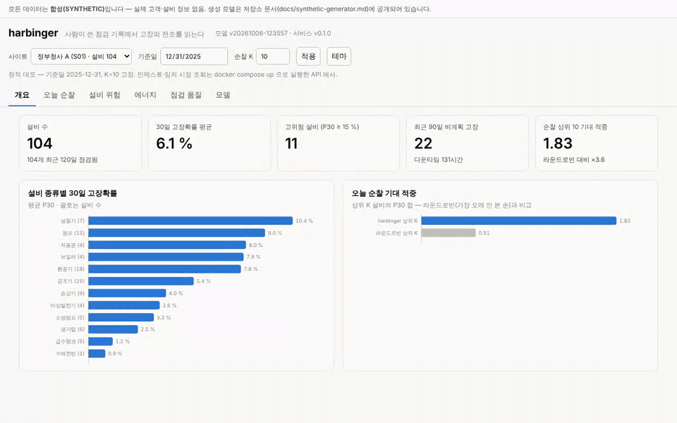
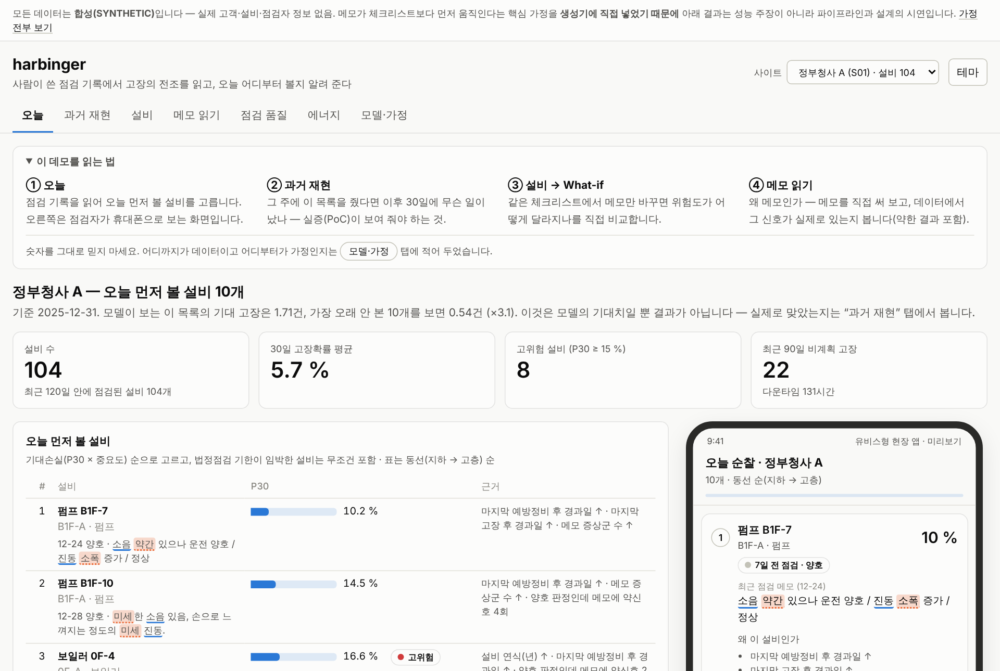
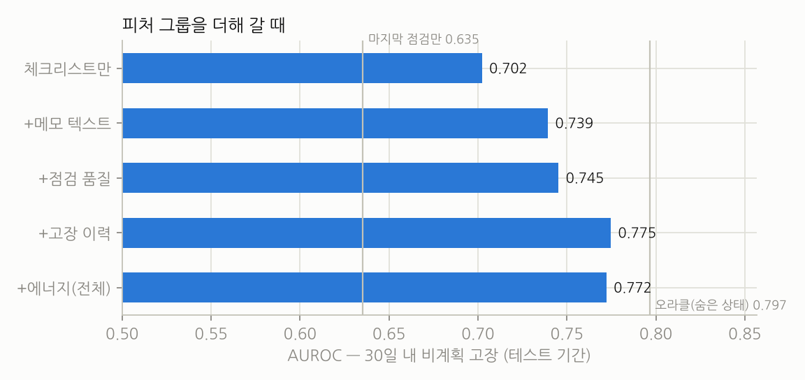

# harbinger

**사람이 쓴 점검 기록에서 설비 고장의 전조를 읽는다.** 센서가 없는 건물에서, 점검자가 남긴 체크리스트·한국어 메모·고장 이력·에너지 검침만으로
30일 내 고장 확률과 생존곡선을 추정하고, **오늘 먼저 볼 설비·권고 점검 주기·근거 문장**으로 바꿔 API 와 리포트로 내보내는 분석 엔진입니다.

> 모든 데이터는 **합성(SYNTHETIC)** 입니다. 실제 고객·설비·점검자 정보 없음. 생성 모델은 [docs/synthetic-generator.md](docs/synthetic-generator.md) 에 전부 공개되어 있고, 아래 숫자는 그 모델 아래에서의 값입니다.

## 데모

**바로 열기**: <https://sokldjs554.github.io/harbinger/> — 백엔드 없이 동작하는 정적 데모입니다. 전체 합성 번들(25 사이트·2,312 설비)로 미리 계산한 API 응답을 콘솔이 그대로 읽습니다.
기준일 2025-12-31, 순찰 K=10 고정. 사이트별 실증 리포트는 [docs/demo/reports](docs/demo/reports) 에 있습니다.

| 탭 | 해 볼 수 있는 것 |
|---|---|
| 오늘 | 오늘 먼저 볼 설비(동선 순)와 **점검자 폰 화면 미리보기** — 설비마다 마지막 점검 메모를 읽는 규칙대로 표시해 왜 올라왔는지 보인다 |
| 과거 재현 | 매주 **그 시점의 데이터만으로** 상위 K 를 뽑고 이후 30일의 실제 고장과 대조. 라운드로빈(가장 오래 안 본 순)과 나란히, 학습·보정에 쓰지 않은 기간만 |
| 설비 | 생존곡선·권고 점검 주기·SHAP·메모 원문 근거, 그리고 **What-if** — 마지막 점검 한 건만 바꿨을 때(형식적 메모 / 약신호 메모 / 주의 / 불량) 위험이 어떻게 변하나 |
| 메모 읽기 | 점검 메모를 직접 써 보면 모델이 쓰는 규칙(증상군·강도어·형식적 메모)이 브라우저에서 그대로 돌고, 그 신호가 데이터에 실제로 있는지 기술통계로 확인 |
| 점검 품질 · 에너지 · 모델·가정 | 점검자별 기록 신뢰도 · 전기 사용 실측 vs 기대치 · 보정·절제·드리프트와 **이 결과가 기대는 가정** |



**전체 기능(인제스트·임의 시점 조회·리포트·What-if 직접 입력)**: `docker compose up --build` 후 <http://localhost:8000/console/> · <http://localhost:8000/docs>. 번들이 없으면 기동 시 축소 합성 번들을 만듭니다(2~4분).



## 왜 이 주제인가

(주)디더블유아이는 센서 회사가 아닙니다. 15년간 **사람이 설비 앞에 가서 NFC·비콘을 찍고 체크하고 메모를 적는 일**을 앱으로 옮긴 회사이고(유비스 마스터, 정부청사 13곳 G-FMS),
2026년형 모델에 "축적된 데이터로 장애를 예측하고 최적 운영 시나리오를 제시하는 AI" 를 넣겠다고 공표했습니다. 그 회사에 쌓인 데이터는 센서 시계열이 아니라
**불규칙한 시점의, 사람이 쓴, 주관적이고 결측 많은 점검 기록**입니다. 흔한 센서 기반 예지보전(RUL 회귀)은 그 데이터에 맞지 않습니다.

harbinger 는 그 데이터 형태를 그대로 받아들입니다. 조사 과정과 "회사가 어떤 지원자를 원하는가"에 대한 판단은 [docs/company-research.md](docs/company-research.md) 에 있습니다.

### 흔한 주제 아닌가

**예지보전 자체는 아주 흔한 주제입니다.** "설비 고장 확률을 분류기로 예측하고 AUROC 를 보고한다"만으로는 차별점이 없고, 합성 데이터 위의 AUROC 는 그 자체로 아무것도 증명하지 않습니다. 이 프로젝트에서 흔하지 않다고 주장하는 것은 세 가지뿐입니다.

1. **입력의 형태** — 센서 시계열이 아니라 *사람이 쓴* 불규칙한 점검 기록(판정·한국어 메모·체류 시간)입니다. 같은 "양호"도 누가 몇 초 만에 찍었는지에 따라 증거의 무게가 다르다는 점을 모델에 넣었습니다.
2. **출력의 형태** — 확률이 아니라 오늘의 순찰 목록·권고 점검 주기·메모 원문 근거입니다. 확률만 내고 끝나는 것이 현장에서 쓰이지 않는 가장 흔한 이유라고 보았습니다.
3. **신규 고객사를 따로 잰다** — 공고의 "고객 맞춤형 모델"은 새 고객사에서 첫날부터 되는지의 문제이고, 그래서 leave-one-site-out 을 평가의 일부로 넣었습니다.

그리고 **이 세 가지가 실제로 옳은지는 이 저장소만으로는 알 수 없습니다.** 메모의 약신호가 고장을 앞선다는 효과는 생성 모델이 넣은 가정에서 나온 것이고([한계](docs/limitations.md)), "그 회사의 데이터는 센서가 아니라 사람 기록이다"는 공개 자료에서의 추론이지 확인된 사실이 아닙니다. 그 가정이 틀리면 이 프로젝트의 차별점 1·2 는 사라집니다. 그래서 콘솔에 "이 결과가 기대는 가정" 화면을 따로 두었습니다.


## 무엇이 다른가

| 흔한 접근 | harbinger |
|---|---|
| 센서 시계열 → RUL 회귀 | **체크리스트 + 한국어 메모 + 고장 이력 + 월 검침**만으로 30일 고장 확률·생존곡선 |
| 메모는 버린다 | 메모의 **약신호**("약간의 소음", "미세 진동", "누유 흔적 소량")를 렉시콘 + 문자 CNN 으로 신호화. 메모에 등장한 증상군 수(와 그 롤링 합)가 SHAP 중요도에서 체크리스트 항목들보다 위 |
| 모든 점검 기록을 같은 무게로 | **점검 품질 감사**(복붙 메모·체류 수초·지연)를 피처이자 **증거 가중치**로 — 형식적으로 찍은 "양호"는 덜 믿는다 |
| 고객사마다 모델 하나 | 정부청사·병원·호텔·오피스 25개 사이트를 한 모델로, **신규 고객사(콜드스타트)** 는 leave-one-site-out 으로 따로 측정 |
| 확률만 내고 끝 | **처방**: 기대손실 순 순찰 상위 K(법정점검 강제 포함, 동선 정렬) · 위험 예산 기반 권고 점검 주기 · SHAP + **실제 메모 원문 인용** |
| 숫자만 보여 준다 | **과거 재현**(그 시점 데이터만으로 상위 K → 이후 30일 실제 고장) · **What-if**(마지막 점검만 바꿔 위험 변화) · **메모 분석기**(학습과 같은 규칙을 브라우저에서 실행, 파이썬과 일치 테스트) |
| 노트북 | FastAPI · 모델 레지스트리 · PSI 드리프트 · Prometheus · Docker · Cloud Run / App Runner 구성 · 실증 리포트 엔드포인트 |

## 제품 흐름

```
점검 기록(체크리스트·메모·체류·지연) ─┐
고장수리·예방정비·부품교체 이력      ─┼─▶ point-in-time 피처 <!-- num:metrics.n_features -->116<!-- /num -->개 ─▶ HGB 분류기(검증 구간 보정 선택) ──▶ P30
사이트 일별 에너지(기온·재실 보정)   ─┘                              └▶ 이산시간 위험 네트(메모 CNN·사이트 임베딩) ─▶ S(t)
                                                                                  │
          오늘 순찰 상위 K ◀── 기대손실 × 법정기한 × 동선 ◀──────────────────────────┤
          권고 점검 주기   ◀── 1 − S(Δ) ≤ 5 %, 법정 상한 ◀──────────────────────────┤
          근거 문장        ◀── SHAP 상위 기여 + 메모 원문·지적 항목·이력 ◀───────────┘
          실증 리포트(md)  ◀── 위 전부 + 에너지 이상 + 점검자 신뢰도
```

## 실측 결과 (테스트 기간 2025-07 ~ 2025-12)

숫자는 `scripts/fill_numbers.py` 가 `artifacts/*.json` 에서 채우고 CI 가 불일치를 검사합니다. 전체 표와 읽는 법은 [docs/evaluation.md](docs/evaluation.md).

**30일 내 비계획 고장 (점검 행 <!-- num:metrics.classifier.hgb_full.n|,d -->19,501<!-- /num -->개, 양성 <!-- num:metrics.classifier.hgb_full.pos_rate|.1% -->8.1%<!-- /num -->)**

| | AUROC | PR-AUC | Brier | ECE |
|---|---:|---:|---:|---:|
| 마지막 점검 판정만 (현장의 현재 규칙) | <!-- num:metrics.baselines.last_inspection.auroc|.3f -->0.635<!-- /num --> | <!-- num:metrics.baselines.last_inspection.pr_auc|.3f -->0.153<!-- /num --> | <!-- num:metrics.baselines.last_inspection.brier|.4f -->0.0715<!-- /num --> | – |
| **harbinger HGB** | **<!-- num:metrics.classifier.hgb_full.auroc|.3f -->0.772<!-- /num -->** | **<!-- num:metrics.classifier.hgb_full.pr_auc|.3f -->0.251<!-- /num -->** | **<!-- num:metrics.classifier.hgb_full.brier|.4f -->0.0676<!-- /num -->** | **<!-- num:metrics.classifier.hgb_full.ece|.4f -->0.0060<!-- /num -->** |
| 이산시간 위험 네트 (P30) | <!-- num:survival.deep.text+site.p30.auroc|.3f -->0.768<!-- /num --> | <!-- num:survival.deep.text+site.p30.pr_auc|.3f -->0.234<!-- /num --> | <!-- num:survival.deep.text+site.p30.brier|.4f -->0.0682<!-- /num --> | <!-- num:survival.deep.text+site.p30.ece|.4f -->0.0062<!-- /num --> |
| 오라클 — 숨은 열화 상태를 아는 상한 | <!-- num:metrics.baselines.oracle_latent_state.auroc|.3f -->0.797<!-- /num --> | <!-- num:metrics.baselines.oracle_latent_state.pr_auc|.3f -->0.273<!-- /num --> | <!-- num:metrics.baselines.oracle_latent_state.brier|.4f -->0.0667<!-- /num --> | – |

**어떤 데이터가 기여하나 (절제, AUROC)**: 체크리스트만 <!-- num:ablation.checklist_only.auroc|.3f -->0.702<!-- /num --> → +메모 텍스트 <!-- num:ablation.+text.auroc|.3f -->0.739<!-- /num --> → +점검 품질 <!-- num:ablation.+text+quality.auroc|.3f -->0.745<!-- /num --> → +고장 이력 <!-- num:ablation.+text+quality+history.auroc|.3f -->0.775<!-- /num --> → +에너지 <!-- num:ablation.full(+energy).auroc|.3f -->0.772<!-- /num -->.
전체에서 메모를 빼면 <!-- num:ablation.full−text.auroc|.3f -->0.771<!-- /num -->.



**오늘 순찰 상위 10개 — 그 뒤 30일에 실제로 고장난 비율**

두 가지로 쟀고, 숫자가 다른 데는 이유가 있습니다.

① **순수 위험순 평가** — 테스트 기간 <!-- num:patrol.days -->18<!-- /num -->일 × 25 사이트, 모든 설비를 P30 만으로 줄 세운 상위 10 (기본 고장률 <!-- num:patrol.base_rate|.1% -->7.2%<!-- /num -->)

| 라운드로빈(가장 오래 안 본 순) | 무작위 | 마지막 점검 판정순 | **harbinger** |
|---:|---:|---:|---:|
| <!-- num:patrol.methods.round_robin.precision_at_k|.1% -->4.3%<!-- /num --> | <!-- num:patrol.methods.random.precision_at_k|.1% -->6.8%<!-- /num --> | <!-- num:patrol.methods.last_inspection.precision_at_k|.1% -->12.2%<!-- /num --> | **<!-- num:patrol.methods.harbinger_hgb.precision_at_k|.1% -->25.4%<!-- /num -->** |

무작위의 <!-- num:patrol.methods.harbinger_hgb.lift_vs_random|.1f -->3.7<!-- /num -->배, 라운드로빈의 <!-- num:patrol.methods.harbinger_hgb.lift_vs_round_robin|.1f -->6.0<!-- /num -->배입니다. 라운드로빈이 무작위보다 낮은 이유는 [평가 §4](docs/evaluation.md) 에 있습니다.

② **제품이 실제로 내는 목록으로 매주 재현** — 콘솔 "과거 재현" 탭과 같은 계산입니다. 기대손실(P30 × 설비 중요도)로 고르고 법정점검 기한 임박 설비는 무조건 포함하므로 위험이 낮아도 올라오는 설비가 있고, 그래서 ①보다 낮습니다. 보류 기간(<!-- num:replay_summary.heldout_start -->2025-07-01<!-- /num --> 이후) <!-- num:replay_summary.weeks -->22<!-- /num -->주 × 25 사이트

| 라운드로빈 | harbinger 목록 | 기본 고장률 |
|---:|---:|---:|
| <!-- num:replay_summary.round_robin_rate|.1% -->4.2%<!-- /num --> | **<!-- num:replay_summary.harbinger_rate|.1% -->21.6%<!-- /num -->** (<!-- num:replay_summary.harbinger_hits|,d -->1,189<!-- /num -->/<!-- num:replay_summary.harbinger_picks|,d -->5,500<!-- /num -->) | <!-- num:replay_summary.base_rate|.1% -->7.6%<!-- /num --> |

테스트 기간 고장 <!-- num:patrol.recall_top20pct.breakdowns_evaluated|,d -->895<!-- /num -->건 중 <!-- num:patrol.recall_top20pct.recall|.0% -->59%<!-- /num --> 는 고장 직전 마지막 점검 때 이미 사이트 위험 상위 20 % 안에 있었습니다.

**생존·콜드스타트·에너지**: Cox C-index <!-- num:survival.lifelines.cox.c_index|.3f -->0.689<!-- /num --> · 위험 네트 C-index <!-- num:survival.deep.text+site.c_index|.3f -->0.658<!-- /num --> (IBS <!-- num:survival.deep.text+site.ibs|.4f -->0.0648<!-- /num -->) ·
처음 보는 사이트(leave-one-site-out, 자체 데이터 없음) AUROC <!-- num:loso.mean_by_months.0.auroc|.3f -->0.769<!-- /num --> vs 그 사이트를 포함해 학습한 모델 <!-- num:loso.mean_warm.auroc|.3f -->0.767<!-- /num --> ·
일 전기 kWh 회귀 MAPE <!-- num:energy.test.mape|.1% -->2.6%<!-- /num -->, 여름 잔차와 숨은 냉방설비 열화의 상관 <!-- num:energy.oracle_check.summer_corr_resid_vs_cooling_degradation|.2f -->0.14<!-- /num -->.

**정직하게 적어야 할 것**

- **오라클 상한과 메모 효과는 생성 모델의 가정에 달려 있습니다.** 열화-고장 결합 강도(`BETA_SCALE`)는 "모델 간 차이가 보이도록" 올린 값이고([왜 그랬는지](docs/synthetic-generator.md#2-숨은-열화와-고장)), 메모 피처의 기여는 "성실한 점검자는 체크리스트가 넘어가기 전에 메모에 먼저 쓴다"는 가정에서 나옵니다. 데이터 안에서는 "양호"인데 메모에 약신호가 있는 점검의 30일 내 고장률이 <!-- num:signals.by_judgement.good.with_weak.rate|.1% -->10.6%<!-- /num -->, 없는 점검은 <!-- num:signals.by_judgement.good.without_weak.rate|.1% -->3.9%<!-- /num --> 입니다. 이것은 가정이 생성기에 들어 있다는 확인이지 현실에서의 발견이 아닙니다.
- **가정이 항상 같은 방향으로 드러나지는 않습니다.** "주의"·"불량" 판정에서는 메모에 약신호가 있는 쪽이 오히려 고장률이 낮고(원인은 확정하지 못했습니다. 조치로 막은 고장이 라벨에서 빠지는 효과가 한 후보입니다), 점검자의 형식적 메모 비율은 "양호"의 고장률에 뚜렷한 기울기를 만들지 못했습니다. 콘솔 "메모 읽기" 탭에 그대로 보입니다.
- **What-if 에서 "불량 + 수리 요청"으로 적으면 "전부 양호 + 특이사항 없음"보다도 위험이 낮게 나옵니다.** 라벨 정의(점검에서 잡아 조치한 고장은 양성이 아님) 때문이고, 숨기지 않으려고 프리셋에 일부러 넣었습니다. 반대로 체크리스트가 같고 메모만 "약간·미세" 약신호로 바뀐 경우는 위험이 올라갑니다(사이트별 상위 위험 설비 200개 중 98 %).
- **보정은 효과가 없었습니다.** 검증 구간에서 교차적합으로 원시·Platt·isotonic 을 비교해 원시 확률보다 로그손실이 0.5 % 이상 좋아질 때만 채택하는데, 이번 번들은 <!-- num:metrics.classifier.hgb_full.calibration_method -->원시 확률(보정 없음)<!-- /num --> 이 선택됐습니다. isotonic 을 무조건 씌웠던 첫 버전은 계단함수 때문에 테스트 ECE 가 나빠졌습니다.
- 콜드스타트 오프셋은 Brier·ECE 를 거의 바꾸지 못했고, 메모 **문자 CNN** 은 렉시콘 피처가 이미 있는 상태에서 AUROC 를 <!-- num:survival.deep.notext+site.p30.auroc|.3f -->0.765<!-- /num --> → <!-- num:survival.deep.text+site.p30.auroc|.3f -->0.768<!-- /num --> 로밖에 올리지 못했습니다. 템플릿으로 만든 합성 메모에서는 렉시콘이 거의 전부를 잡기 때문이고, 실제 현장 메모에서는 다시 재야 합니다.

실데이터에서 **가장 먼저 확인할 것들**이 [docs/real-data-checklist.md](docs/real-data-checklist.md) 에 있습니다.

## 공고의 요구 기술이 저장소 어디에 있나

| 공고 | 저장소 |
|---|---|
| Python 기반 데이터 전처리 및 분석 (Pandas, NumPy) | `synth/` 생성기(13만 점검 약 40초) · `features/build.py` point-in-time 피처 <!-- num:metrics.n_features -->116<!-- /num -->개 · 누수 테스트 · `features/refresh.py` 점검 이후 시간 경과 피처 갱신 |
| 머신러닝 기본 (Regression, Classification) | `models/classify.py` HGB + 보정 선택(원시/Platt/isotonic, 교차적합) · `models/energy.py` HGB 회귀 → 잔차 이상 · 로지스틱·연식·마지막점검 베이스라인 |
| 딥러닝 모델 설계 및 성능 개선 (PyTorch / TensorFlow) | `models/deep.py` 이산시간 위험 네트 — 문자 CNN 메모 인코더 + 사이트 임베딩 드롭아웃, 중도절단 NLL · `models/keras_parity.py` 같은 명세의 Keras 구현과 패리티 테스트 |
| 생존·불확실성 | `models/survival.py` Cox PH / Weibull AFT (lifelines) · IPCW Brier · 캘리브레이션(ECE) |
| 분석 결과를 API / 웹 서비스로 (FastAPI) | `api/` 21개 엔드포인트 · 인제스트 → 위험도 즉시 갱신 · 과거 재현 · What-if · 메모 분석 · 실증 리포트(md) · `console/` 대시보드 |
| 데이터 시각화 | `console/` 바닐라 SVG 차트(라이트/다크, 접근성 팔레트) · `scripts/make_figures.py` 문서 그림 |
| 클라우드 (AWS, GCP) | `Dockerfile`(CPU torch, 비루트) · `deploy/gcp/` Cloud Build + Cloud Run · `deploy/aws/` ECR + App Runner |
| 실제 서비스 운영 | 모델 레지스트리·버전 롤백 · PSI 드리프트 · Prometheus 메트릭 · JSON 로그 · [런북](docs/ops/runbook.md) · CI(린트·테스트·스모크·숫자 검사·이미지 빌드) |
| 실증 프로젝트 및 고객 맞춤형 모델 | 아키타입 4종 25 사이트 · LOSO 콜드스타트 · 사이트 오프셋 · `/report` · [실데이터 4주 체크리스트](docs/real-data-checklist.md) |

## 실행

```bash
# 1) 로컬 (Python 3.11+)
make install            # CPU torch + 개발 의존성
make pipeline           # synth → features → eval → figures → numbers  (약 30분, 4 vCPU)
make serve              # http://localhost:8000/console/  ·  http://localhost:8000/docs

# 2) 컨테이너 — 번들이 없으면 기동 시 축소 합성 번들을 만든다(2~4분)
docker compose up --build
```

```bash
curl -s "localhost:8000/v1/sites/S01/patrol/today?k=8" | jq '.items[] | {rank, name, p30, mandatory, reasons}'
curl -s "localhost:8000/v1/sites/S01/assets/A-S01-0007/risk" | jq '{p30, recommendation, memos: [.explanation.evidence.recent_inspections[].memo_highlighted]}'
curl -s "localhost:8000/v1/sites/S01/report?format=md"
```

## 저장소 구조

```
src/harbinger/
  synth/       생성 모델 — 아키타입·설비·열화·점검자 성향·한국어 메모·고장·에너지
  features/    point-in-time 피처 — 체크리스트·텍스트 렉시콘·점검 품질·이력·에너지 잔차
  models/      HGB 분류·Cox/AFT·PyTorch 위험 네트·에너지 회귀·캘리브레이션·콜드스타트·레지스트리·Keras 패리티
  eval/        시간 분할·베이스라인·절제·IPCW·순찰 시뮬레이션·LOSO
  prescribe/   순찰 우선순위·권고 주기·SHAP+근거 인용
  api/         FastAPI 라우터·스토어·인제스트·리포트·과거 재현·What-if     console/  대시보드·메모 분석기     monitoring/  드리프트·메트릭
tests/         생성기 결정론·누수·라벨·NLL 폐형해·처방 불변식·API·Keras 패리티
deploy/        Cloud Run · App Runner · Prometheus         docs/  설계·평가·한계·런북·회사 조사
```

## 문서

- [회사 조사 — 왜 이 주제인가](docs/company-research.md)
- [데이터 모델 (역추론 스키마, 실데이터 전환 지점)](docs/data-model.md)
- [합성 데이터 생성 모델 — 전부 공개](docs/synthetic-generator.md)
- [모델링](docs/modeling.md) · [평가](docs/evaluation.md) · [API](docs/api.md)
- [운영 런북](docs/ops/runbook.md) · [한계](docs/limitations.md) · [실데이터 적용 체크리스트](docs/real-data-checklist.md)
- [이 저장소가 만들어진 방식](docs/how-this-was-built.md)

## 범위

실데이터 없음 · 콘솔은 인증 없는 데모 · 단일 프로세스 메모리 적재(사이트 100개 이상이면 저장소 분리) · 유비스 하이(환자이송)는 설계 메모만([한계 §8](docs/limitations.md)).
