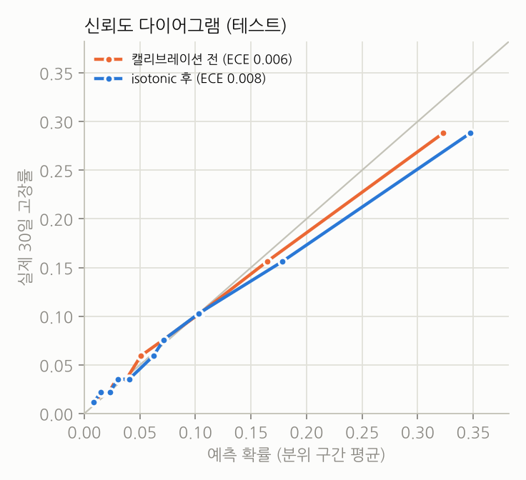
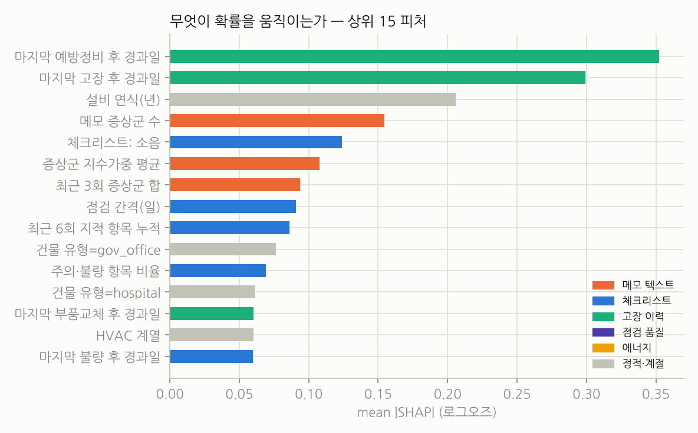
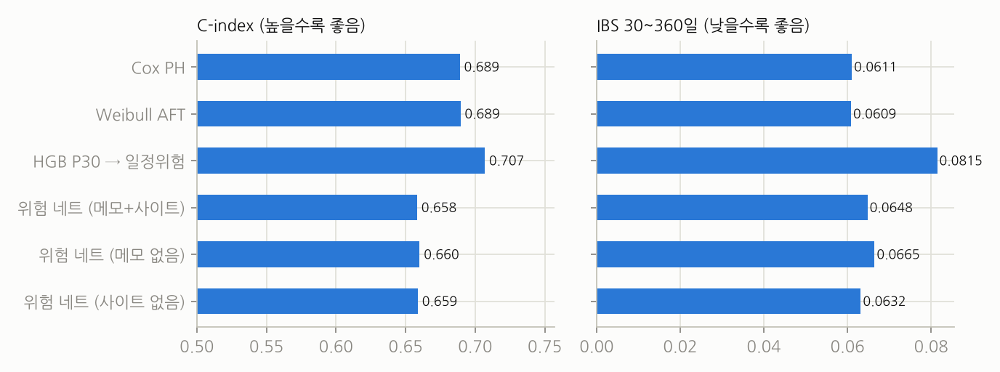
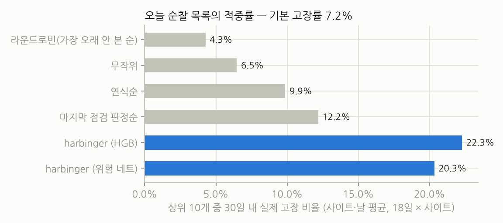
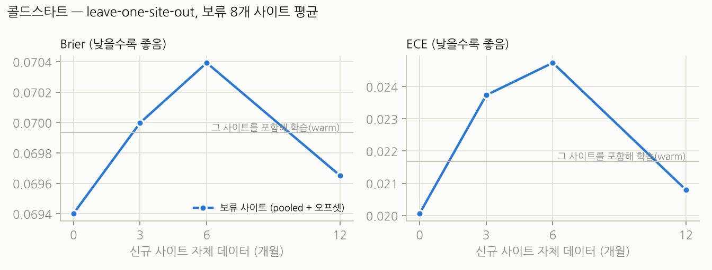
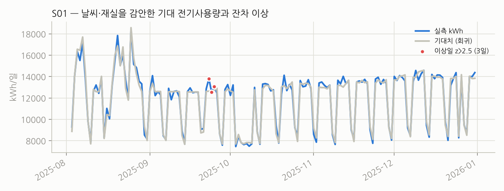

# 평가 — 무엇을 어떻게 재고, 숫자는 무엇을 뜻하나

> 모든 숫자는 합성 데이터(`docs/synthetic-generator.md`)에서 나왔고, `scripts/fill_numbers.py` 가 `artifacts/*.json` 에서 채운다. CI 가 문서와 산출물의 불일치를 검사한다.

## 분할

시간순 분할. 학습 2023-01 ~ 2024-12 (24개월), 검증 2025-01 ~ 2025-06 (캘리브레이션·조기종료), 테스트 2025-07 ~ 2025-12.
테스트 기간 점검 행 <!-- num:metrics.classifier.hgb_full.n|,d -->19,501<!-- /num -->개, 30일 내 고장 비율 <!-- num:metrics.classifier.hgb_full.pos_rate|.1% -->8.1%<!-- /num -->.
사이트는 섞여 있다(모든 사이트가 학습·테스트에 모두 등장) — 신규 사이트 상황은 §5 LOSO 에서 따로 잰다.

## 1. 30일 내 비계획 고장 — 분류

| 모델 | AUROC | PR-AUC | Brier | ECE |
|---|---:|---:|---:|---:|
| **harbinger HGB (전체 피처, isotonic)** | **<!-- num:metrics.classifier.hgb_full.auroc|.3f -->0.772<!-- /num -->** | **<!-- num:metrics.classifier.hgb_full.pr_auc|.3f -->0.251<!-- /num -->** | **<!-- num:metrics.classifier.hgb_full.brier|.4f -->0.0683<!-- /num -->** | **<!-- num:metrics.classifier.hgb_full.ece|.4f -->0.0084<!-- /num -->** |
| HGB 캘리브레이션 전 | <!-- num:metrics.classifier.hgb_full_uncalibrated.auroc|.3f -->0.772<!-- /num --> | <!-- num:metrics.classifier.hgb_full_uncalibrated.pr_auc|.3f -->0.251<!-- /num --> | <!-- num:metrics.classifier.hgb_full_uncalibrated.brier|.4f -->0.0676<!-- /num --> | <!-- num:metrics.classifier.hgb_full_uncalibrated.ece|.4f -->0.0060<!-- /num --> |
| 로지스틱 회귀 (전체 피처) | <!-- num:metrics.baselines.logistic_full.auroc|.3f -->0.756<!-- /num --> | <!-- num:metrics.baselines.logistic_full.pr_auc|.3f -->0.219<!-- /num --> | <!-- num:metrics.baselines.logistic_full.brier|.4f -->0.0695<!-- /num --> | <!-- num:metrics.baselines.logistic_full.ece|.4f -->0.0110<!-- /num --> |
| 마지막 점검 판정만 | <!-- num:metrics.baselines.last_inspection.auroc|.3f -->0.635<!-- /num --> | <!-- num:metrics.baselines.last_inspection.pr_auc|.3f -->0.153<!-- /num --> | <!-- num:metrics.baselines.last_inspection.brier|.4f -->0.0716<!-- /num --> | – |
| 연식·중요도·종류만 | <!-- num:metrics.baselines.age_only.auroc|.3f -->0.631<!-- /num --> | <!-- num:metrics.baselines.age_only.pr_auc|.3f -->0.117<!-- /num --> | <!-- num:metrics.baselines.age_only.brier|.4f -->0.0733<!-- /num --> | – |
| 상수(사전확률) | 0.500 | <!-- num:metrics.baselines.constant_prior.pr_auc|.3f -->0.081<!-- /num --> | <!-- num:metrics.baselines.constant_prior.brier|.4f -->0.0745<!-- /num --> | – |
| **오라클** — 숨은 열화 상태로 계산한 진짜 확률 (상한) | <!-- num:metrics.baselines.oracle_latent_state.auroc|.3f -->0.797<!-- /num --> | <!-- num:metrics.baselines.oracle_latent_state.pr_auc|.3f -->0.273<!-- /num --> | <!-- num:metrics.baselines.oracle_latent_state.brier|.4f -->0.0667<!-- /num --> | – |

읽는 법: 오라클과 harbinger 의 차이가 **사람의 관측에서 잃는 것**이고, 오라클과 1.0 의 차이가 **돌발 고장**이다. 마지막 점검 판정만 보는 것이 현장의 현재 규칙에 가장 가깝다.

캘리브레이션: isotonic 은 검증 구간(2025-01~06)에서 적합하고, **검증 Brier 가 실제로 낮아질 때만 채택**한다(이번 번들 채택 여부: <!-- num:metrics.classifier.hgb_full.calibration_adopted -->채택<!-- /num -->, 검증 Brier 원시 <!-- num:metrics.classifier.hgb_full.calibration_val_brier_raw|.4f -->0.0657<!-- /num --> vs isotonic <!-- num:metrics.classifier.hgb_full.calibration_val_brier_isotonic|.4f -->0.0653<!-- /num -->). 로그손실로 학습한 HGB 는 이미 확률 척도가 맞는 경우가 많고, 억지로 계단함수를 씌우면 테스트 ECE 가 오히려 나빠질 수 있다는 것이 첫 실행에서 확인됐다(0.005 → 0.009).



## 2. 절제 — 어떤 데이터가 기여하나

| 피처 | AUROC | PR-AUC | 피처 수 |
|---|---:|---:|---:|
| 체크리스트만 (+정적·계절) | <!-- num:ablation.checklist_only.auroc|.3f -->0.702<!-- /num --> | <!-- num:ablation.checklist_only.pr_auc|.3f -->0.200<!-- /num --> | <!-- num:ablation.checklist_only.n_features -->62<!-- /num --> |
| + 메모 텍스트 | <!-- num:ablation.+text.auroc|.3f -->0.739<!-- /num --> | <!-- num:ablation.+text.pr_auc|.3f -->0.215<!-- /num --> | <!-- num:ablation.+text.n_features -->90<!-- /num --> |
| + 점검 품질 | <!-- num:ablation.+text+quality.auroc|.3f -->0.745<!-- /num --> | <!-- num:ablation.+text+quality.pr_auc|.3f -->0.214<!-- /num --> | <!-- num:ablation.+text+quality.n_features -->101<!-- /num --> |
| + 고장·정비 이력 | <!-- num:ablation.+text+quality+history.auroc|.3f -->0.775<!-- /num --> | <!-- num:ablation.+text+quality+history.pr_auc|.3f -->0.251<!-- /num --> | <!-- num:ablation.+text+quality+history.n_features -->111<!-- /num --> |
| + 에너지 잔차 (전체) | <!-- num:ablation.full(+energy).auroc|.3f -->0.772<!-- /num --> | <!-- num:ablation.full(+energy).pr_auc|.3f -->0.251<!-- /num --> | <!-- num:ablation.full(+energy).n_features -->116<!-- /num --> |
| 전체 − 메모 텍스트 | <!-- num:ablation.full−text.auroc|.3f -->0.771<!-- /num --> | <!-- num:ablation.full−text.pr_auc|.3f -->0.251<!-- /num --> | |
| 전체 − 점검 품질 | <!-- num:ablation.full−quality.auroc|.3f -->0.772<!-- /num --> | <!-- num:ablation.full−quality.pr_auc|.3f -->0.247<!-- /num --> | |




## 3. 생존 — 고장까지의 시간

| 모델 | C-index | IBS (30~360일) | P30 AUROC |
|---|---:|---:|---:|
| Cox PH | <!-- num:survival.lifelines.cox.c_index|.3f -->0.689<!-- /num --> | <!-- num:survival.lifelines.cox.ibs|.4f -->0.0611<!-- /num --> | <!-- num:survival.lifelines.cox.p30.auroc|.3f -->0.704<!-- /num --> |
| Weibull AFT | <!-- num:survival.lifelines.aft.c_index|.3f -->0.689<!-- /num --> | <!-- num:survival.lifelines.aft.ibs|.4f -->0.0609<!-- /num --> | <!-- num:survival.lifelines.aft.p30.auroc|.3f -->0.704<!-- /num --> |
| HGB P30 → 일정 위험으로 펼침 | <!-- num:survival.lifelines.hgb_constant_hazard.c_index|.3f -->0.707<!-- /num --> | <!-- num:survival.lifelines.hgb_constant_hazard.ibs|.4f -->0.0815<!-- /num --> | – |
| **이산시간 위험 네트 (메모 CNN + 사이트 임베딩)** | <!-- num:survival.deep.text+site.c_index|.3f -->0.658<!-- /num --> | <!-- num:survival.deep.text+site.ibs|.4f -->0.0648<!-- /num --> | <!-- num:survival.deep.text+site.p30.auroc|.3f -->0.768<!-- /num --> |
| 위험 네트 − 메모 | <!-- num:survival.deep.notext+site.c_index|.3f -->0.660<!-- /num --> | <!-- num:survival.deep.notext+site.ibs|.4f -->0.0665<!-- /num --> | <!-- num:survival.deep.notext+site.p30.auroc|.3f -->0.765<!-- /num --> |
| 위험 네트 − 사이트 임베딩 | <!-- num:survival.deep.text+nosite.c_index|.3f -->0.659<!-- /num --> | <!-- num:survival.deep.text+nosite.ibs|.4f -->0.0632<!-- /num --> | <!-- num:survival.deep.text+nosite.p30.auroc|.3f -->0.768<!-- /num --> |

위험 네트 파라미터 <!-- num:survival.deep.text+site.n_params|,d -->96,828<!-- /num -->개, 학습 <!-- num:survival.deep.text+site.epochs_run -->11<!-- /num --> 에포크(조기종료), CPU <!-- num:survival.deep.text+site.train_seconds|.0f -->140<!-- /num -->초.

읽는 법: 메모 문자 CNN 은 렉시콘 피처 위에서 P30 AUROC 를 아주 조금만 올리고(위 표의 '− 메모' 행과 비교) 학습 시간은 수십 배 든다. 합성 메모가 템플릿에서 나오기 때문에 어근 렉시콘이 거의 전부를 잡는다 — 실제 현장 메모(오타·은어·축약)에서는 문자 모델의 가치가 달라질 수 있어 두 경로를 모두 남겼다. 사이트 임베딩을 빼도 거의 같다는 것은 pooled 모델이 사이트 간 차이를 피처로 이미 설명한다는 뜻이고, §5 의 콜드스타트 결과와 일치한다.



## 4. 순찰 시뮬레이션 — 오늘 상위 10개를 고르면

테스트 기간 매주, 사이트마다 "오늘 먼저 볼 10개"를 각 방법으로 고르고 그 뒤 30일에 실제 고장난 비율을 센다 (<!-- num:patrol.days -->18<!-- /num -->일 × 25 사이트). 기본 고장률(아무 설비나 골랐을 때) <!-- num:patrol.base_rate|.1% -->7.2%<!-- /num -->.

| 방법 | precision@10 | 라운드로빈 대비 |
|---|---:|---:|
| 라운드로빈 — 가장 오래 안 본 설비부터 (현장 기본 규칙) | <!-- num:patrol.methods.round_robin.precision_at_k|.1% -->4.3%<!-- /num --> | ×1.00 |
| 무작위 | <!-- num:patrol.methods.random.precision_at_k|.1% -->6.5%<!-- /num --> | ×<!-- num:patrol.methods.random.lift_vs_round_robin|.2f -->1.52<!-- /num --> |
| 연식순 | <!-- num:patrol.methods.age.precision_at_k|.1% -->9.9%<!-- /num --> | ×<!-- num:patrol.methods.age.lift_vs_round_robin|.2f -->2.31<!-- /num --> |
| 마지막 점검 판정순 | <!-- num:patrol.methods.last_inspection.precision_at_k|.1% -->12.2%<!-- /num --> | ×<!-- num:patrol.methods.last_inspection.lift_vs_round_robin|.2f -->2.85<!-- /num --> |
| **harbinger (HGB)** | **<!-- num:patrol.methods.harbinger_hgb.precision_at_k|.1% -->22.3%<!-- /num -->** | **×<!-- num:patrol.methods.harbinger_hgb.lift_vs_round_robin|.2f -->5.22<!-- /num -->** |
| harbinger (위험 네트) | <!-- num:patrol.methods.harbinger_deep.precision_at_k|.1% -->20.3%<!-- /num --> | ×<!-- num:patrol.methods.harbinger_deep.lift_vs_round_robin|.2f -->4.77<!-- /num --> |

테스트 기간 고장 <!-- num:patrol.recall_top20pct.breakdowns_evaluated|,d -->895<!-- /num -->건 중, 고장 직전 마지막 점검 때 그 설비가 사이트 위험 상위 20 % 안에 있었던 비율: **<!-- num:patrol.recall_top20pct.recall|.1% -->58.9%<!-- /num -->**.



라운드로빈이 무작위보다 못한 이유: 가장 오래 안 본 설비는 점검 주기가 긴(30일) 법정·저위험 설비 쪽으로 쏠리고, 막 점검해서 뭔가 발견된 설비는 뒤로 밀린다. 현장의 기본 규칙이 가진 구조적 약점이고, 법정 설비는 처방에서 **별도 규칙**으로 보장하는 이유다.

## 5. 콜드스타트 — leave-one-site-out

아키타입별 2개, 총 <!-- num:loso.holdout_sites.__len__ -->8<!-- /num -->개 사이트를 보류. 나머지로 학습한 pooled 모델 + 보류 사이트 자체 데이터 m 개월로 추정한 로짓 오프셋.

| 자체 데이터 | AUROC | PR-AUC | Brier | ECE |
|---|---:|---:|---:|---:|
| 0개월 (완전 콜드) | <!-- num:loso.mean_by_months.0.auroc|.3f -->0.769<!-- /num --> | <!-- num:loso.mean_by_months.0.pr_auc|.3f -->0.270<!-- /num --> | <!-- num:loso.mean_by_months.0.brier|.4f -->0.0694<!-- /num --> | <!-- num:loso.mean_by_months.0.ece|.4f -->0.0201<!-- /num --> |
| 3개월 | <!-- num:loso.mean_by_months.3.auroc|.3f -->0.769<!-- /num --> | <!-- num:loso.mean_by_months.3.pr_auc|.3f -->0.270<!-- /num --> | <!-- num:loso.mean_by_months.3.brier|.4f -->0.0700<!-- /num --> | <!-- num:loso.mean_by_months.3.ece|.4f -->0.0237<!-- /num --> |
| 6개월 | <!-- num:loso.mean_by_months.6.auroc|.3f -->0.769<!-- /num --> | <!-- num:loso.mean_by_months.6.pr_auc|.3f -->0.270<!-- /num --> | <!-- num:loso.mean_by_months.6.brier|.4f -->0.0704<!-- /num --> | <!-- num:loso.mean_by_months.6.ece|.4f -->0.0247<!-- /num --> |
| 12개월 | <!-- num:loso.mean_by_months.12.auroc|.3f -->0.769<!-- /num --> | <!-- num:loso.mean_by_months.12.pr_auc|.3f -->0.270<!-- /num --> | <!-- num:loso.mean_by_months.12.brier|.4f -->0.0697<!-- /num --> | <!-- num:loso.mean_by_months.12.ece|.4f -->0.0208<!-- /num --> |
| (비교) 그 사이트를 포함해 학습한 warm 모델 | <!-- num:loso.mean_warm.auroc|.3f -->0.767<!-- /num --> | <!-- num:loso.mean_warm.pr_auc|.3f -->0.267<!-- /num --> | <!-- num:loso.mean_warm.brier|.4f -->0.0699<!-- /num --> | <!-- num:loso.mean_warm.ece|.4f -->0.0217<!-- /num --> |

읽는 법: 오프셋은 사이트 전체에 같은 로짓 상수를 더하므로 **사이트 내 순위(AUROC·PR-AUC)는 정의상 변하지 않는다.** 자체 데이터가 바꾸는 것은 확률 척도(Brier·ECE)다. 완전 콜드(0개월)와 warm 의 AUROC 차이가 "그 사이트를 학습에 포함했을 때 더 얻는 순위 정보"이고, 그 차이가 작다는 것이 pooled 모델이 신규 고객사에 바로 쓸 만하다는 뜻이다.



## 6. 에너지 회귀

테스트 기간 일 전기 kWh: MAE <!-- num:energy.test.mae|,.0f -->336<!-- /num --> kWh, MAPE <!-- num:energy.test.mape|.1% -->2.6%<!-- /num -->, R² <!-- num:energy.test.r2|.3f -->0.997<!-- /num -->.
여름(6~9월) 잔차 7일 평균과 숨은 냉방설비 열화의 상관 <!-- num:energy.oracle_check.summer_corr_resid_vs_cooling_degradation|.2f -->0.14<!-- /num -->, 열화 상위 25 % 를 z 로 맞히는 AUROC <!-- num:energy.oracle_check.auroc_z_vs_high_degradation|.3f -->0.581<!-- /num -->, 이상일 비율 <!-- num:energy.oracle_check.anomaly_day_rate|.1% -->3.5%<!-- /num -->.



## 재현

```bash
make pipeline     # synth → features → eval → figures → numbers
make check-numbers
```

`artifacts/metrics.json` 에 분할·모든 모델·베이스라인·절제·생존·에너지·순찰·LOSO 결과와 번들 버전이 한 파일로 남는다.
